<div align="center">


# Sentinel

### Engineering memory for teams and AI agents.

**Git remembers what changed. Sentinel remembers why.****

Self-hosted engineering decision memory and governance for software teams.

</div>

---

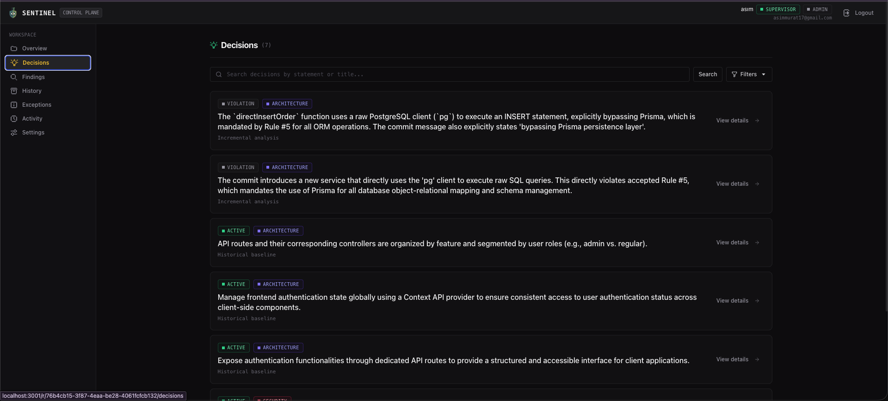

## Why Sentinel?

Software repositories remember **what changed****.

They usually do not remember:

- why an architectural direction was chosen

- which patterns the team intentionally rejected

- which technical constraints are still active

- whether a new change contradicts an earlier decision

- why an exception was allowed

- what an AI coding agent should know before touching the codebase

That context ends up scattered across pull requests, Slack threads, tickets, meetings, and people's heads.

Sentinel turns it into durable engineering memory.

---

## How it works

```text

Repository history

        │

        ▼

Historical analysis

        │

        ▼

Decision Candidates

        │

        ▼

Human review

        │

        ▼

Active Decisions

        │

        ▼

New Git changes

        │

        ▼

Continuous analysis

        │

        ▼

Support / Conflict / Violation / New Candidate

```

Sentinel does not treat every commit as a Decision.

It looks for durable engineering direction, keeps humans in control, and continuously compares new changes against what the team has already accepted.

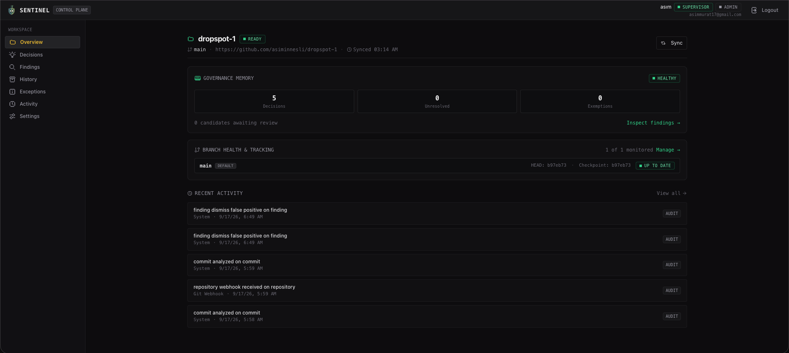

---

## Decisions

Decisions represent:

> **What the team has decided.****

They capture durable engineering direction, not just static rules.

Examples:

- use Prisma as the persistence layer

- keep authentication behind a dedicated service

- keep business logic out of HTTP handlers

- preserve repository/service boundaries

- centralize AI configuration

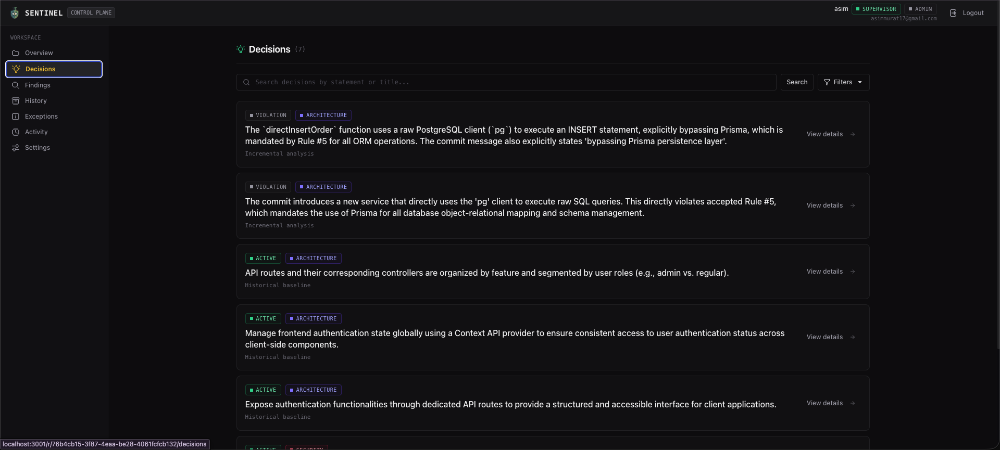

Decisions may evolve over time.

Sentinel preserves whether a Decision is:

```text

Active

Superseded

Deprecated

```

so architectural history is not silently rewritten.

---

## Findings

Findings represent:

> **What needs attention.****

Sentinel surfaces three main types of Findings:

### Decision Candidate

A potentially durable new engineering direction.

### Conflict

A new direction that contradicts an existing Decision.

### Violation

A change that breaks an active Decision.

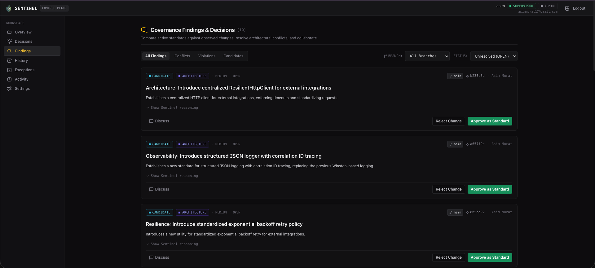

Sentinel keeps the reasoning, source commit, affected Decision, evidence, and review history together.

---

## Violations

When a change breaks an accepted engineering Decision, Sentinel explains the violation instead of reducing it to a generic lint error.

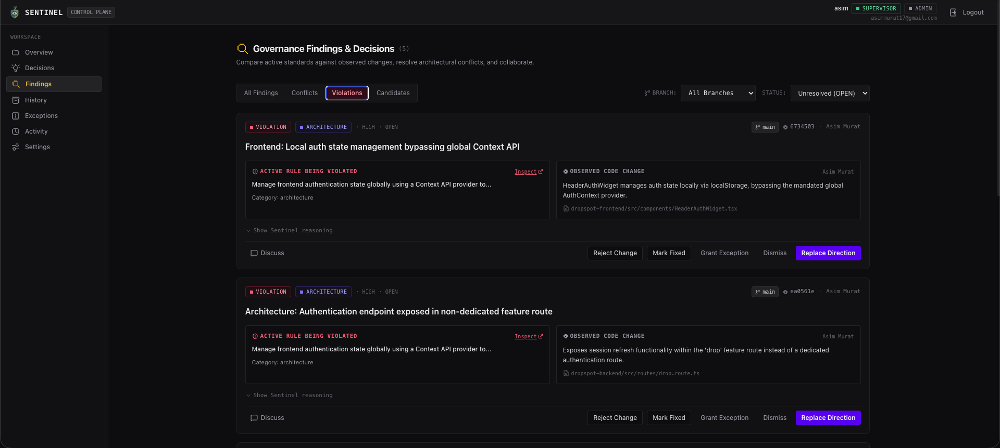

Sentinel v1 is advisory by design.

It does not automatically:

- block commits

- block pushes

- block merges

- rewrite code

- revert changes

Instead, it gives developers, reviewers, and AI agents the context needed to make the right decision.

---

## Conflicts

Not every architectural change is simply "wrong".

Sometimes a change introduces a legitimate new direction that conflicts with an existing Decision.

Sentinel surfaces that as a Conflict so the team can explicitly decide whether to keep the existing direction or accept the new one.

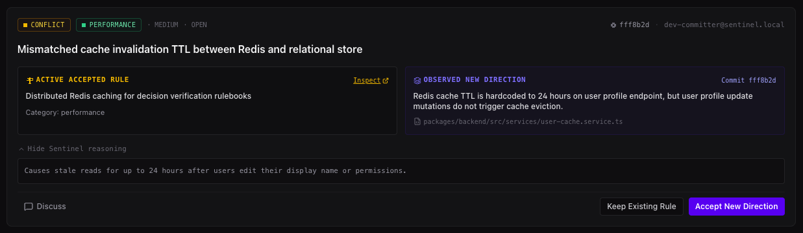

---

## Exceptions

Sometimes a deviation is intentional.

Sentinel supports explicit temporary Exceptions without silently weakening the underlying Decision.

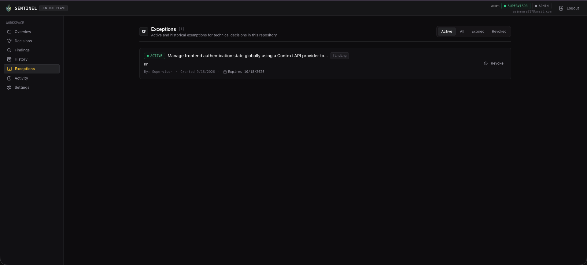

This lets teams distinguish between:

```text

"This change violates our architecture."

```

and:

```text

"This deviation is intentionally allowed for now."

```

---

## Continuous repository monitoring

Sentinel continuously watches repository evolution.

For GitHub repositories:

```text

Developer pushes

      │

      ▼

GitHub webhook

      │

      ▼

Sentinel

      │

      ▼

Fetch latest repository state

      │

      ▼

Incremental analysis

      │

      ▼

New Findings

```

No manual sync is required during normal operation.

Sentinel analyzes only unseen commits rather than rerunning the entire repository history after every push.

---

## Historical bootstrap

When a repository is connected for the first time, Sentinel analyzes its existing Git history.

It looks for durable engineering directions that still appear to be true today.

```text

Git history

    │

    ▼

Signal extraction

    │

    ▼

Related change clustering

    │

    ▼

Engineering direction inference

    │

    ▼

Current-state validation

    │

    ▼

Decision Candidates

```

Humans review those candidates before they become active governance.

---

# Built for AI-assisted development

AI coding agents can write code quickly.

But they usually enter a repository without knowing **why the system looks the way it does****.

Sentinel exposes engineering memory through MCP so an agent can ask:

> What has this team already decided?

before changing code.

And after making a change:

> Does this still respect those Decisions?

---

## Analyze a change before committing

Sentinel can evaluate local work before it reaches Git history.

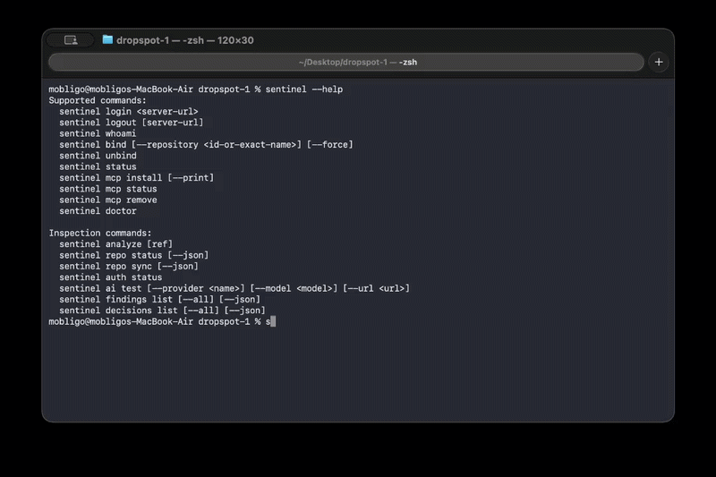

This enables a developer or coding agent to catch architectural violations while the change is still local.

---

## Developer CLI

Developers interact with Sentinel through the `sentinel` CLI.

### Login

```bash

sentinel login https://sentinel.example.com

```

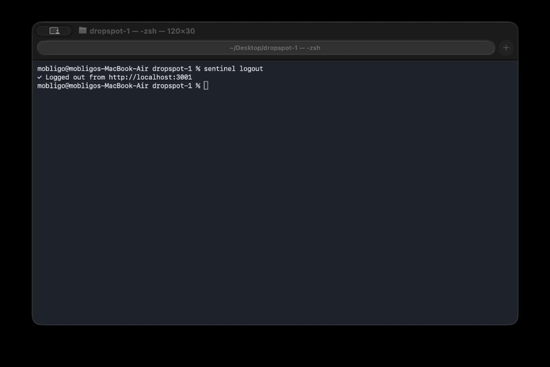

### Verify identity

```bash

sentinel whoami

```

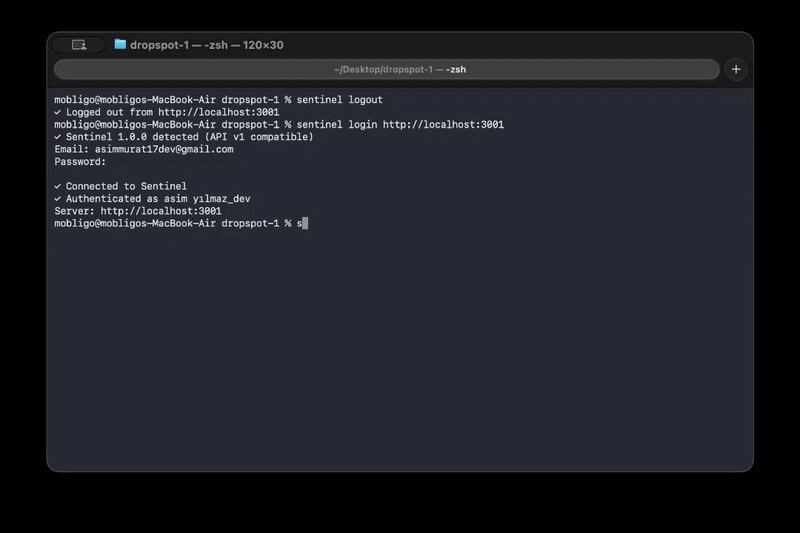

### Bind the current repository

```bash

sentinel bind

```

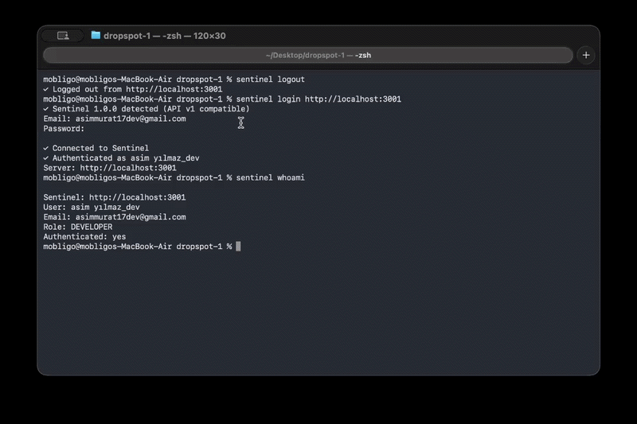

### Check connection and workspace status

```bash

sentinel status

```

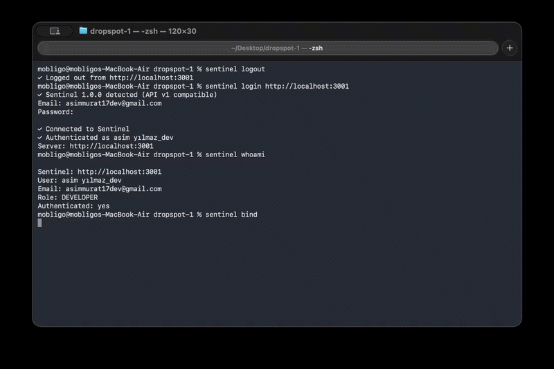

Repository binding is explicit and workspace-aware.

Sentinel does not fall back to the first, last, or previously used repository.

---

## MCP integration

Sentinel works with MCP-compatible coding environments.

Typical setup:

```bash

sentinel login https://sentinel.example.com

cd my-project

sentinel bind

sentinel mcp install

sentinel status

```

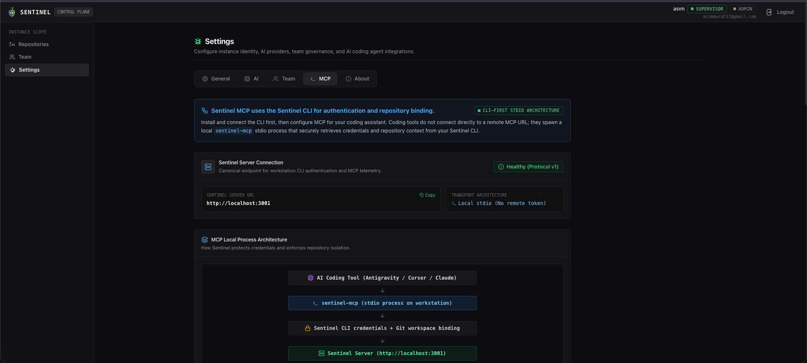

MCP capabilities include:

```text

Get relevant engineering context

Inspect active Decisions

Check a proposed change

Propose new engineering memory

```

Human governance remains the final authority.

---

## Explicit workspace isolation

Every repository-scoped Sentinel MCP request is resolved from the current workspace.

Conceptually:

```text

workspaceRoot

      │

      ▼

Git repository

      │

      ▼

Sentinel binding

      │

      ▼

Matching Sentinel instance

      │

      ▼

Matching repository

      │

      ▼

Engineering context

```

There is no fallback to:

- previous repository

- default repository

- first repository

- last used workspace

This prevents engineering context from one repository being accidentally applied to another.

---

# Self-hosted

Sentinel runs inside your environment.

```text

┌──────────────────────────────────────┐

│        Your infrastructure           │

│                                      │

│   Sentinel                           │

│   ├── Dashboard                      │

│   ├── API                            │

│   ├── Repository analysis            │

│   ├── Engineering memory             │

│   ├── Governance                     │

│   └── AI integration                 │

│                                      │

│   PostgreSQL                         │

│                                      │

│   Your Git repositories              │

│                                      │

└──────────────────────────────────────┘

```

Your code does not need to be sent to a hosted Sentinel service.

Your repository history, Decisions, Findings, governance data, and AI configuration remain inside infrastructure you control.

> **Private by architecture, not by policy.****

---

## AI provider flexibility

Sentinel is designed to work with different AI environments.

Supported deployment patterns include:

- Gemini

- OpenAI-compatible APIs

- Ollama

- vLLM

- internal model gateways

Teams remain in control of which model is used.

---

## Git is required. GitHub is optional.

Sentinel's core is Git-based rather than GitHub-based.

GitHub currently provides webhook integration, while the repository analysis and governance model remain provider-neutral.

---

## Human-governed by design

AI can:

- analyze repository history

- suggest Decision Candidates

- detect support

- detect conflicts

- detect violations

AI cannot silently turn its own output into permanent organizational policy.

Humans remain responsible for:

- approving Decisions

- rejecting Candidates

- resolving Conflicts

- resolving Violations

- granting Exceptions

- replacing or deprecating Decisions

---

## Who Sentinel is for

Sentinel is designed for engineering teams that:

- maintain non-trivial codebases

- care about architectural consistency

- use AI coding tools

- have engineering context spread across people, PRs, tickets, and chat

- want self-hosted infrastructure

- want human control over AI-generated engineering guidance

---

## What Sentinel is not

Sentinel is not:

- a generic code review bot

- a linter

- a static analysis replacement

- a prompt manager

- an AI coding agent

- a Git replacement

- a mandatory CI gate

Sentinel is the engineering memory and governance layer around your development process.

---

## Interested in Sentinel?

Sentinel is currently available for private evaluation with selected engineering teams.

If you are interested in:

- trying Sentinel with your team
- evaluating it on a real repository
- discussing self-hosted deployment
- integrating Sentinel with your AI coding workflow
- providing early product feedback

feel free to get in touch.

### Contact

GitHub: [@asiminnesli](https://github.com/asiminnesli)

You can also open an issue in this repository with the label `contact`.

---

<div align="center">


## Sentinel

### Git remembers what changed. Sentinel remembers why.

Engineering memory for teams and AI agents.

**Private evaluation available — contact me for access.**

</div>